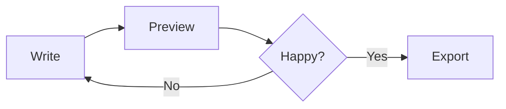
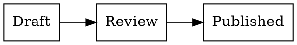

# md

A Markdown preview for people who write documents, not only READMEs.

## Mathematics

The Gaussian integral, inline as $\int_{-\infty}^{\infty} e^{-x^2}\,dx = \sqrt{\pi}$,
and set on its own line:

$$
\frac{\partial u}{\partial t} = \alpha \nabla^2 u
$$

Chemistry comes with it: $\ce{H2SO4 + 2 OH- -> SO4^2- + 2 H2O}$.

## A chart, from a formula

```plot
x: -10..10
y: -1.2..1.2
title: A damped oscillation
xlabel: time
ylabel: amplitude
envelope = exp(-abs(x)/5)
signal = sin(x) * exp(-abs(x)/5)
```

## A diagram





## Code

```typescript
export function renderPlot(source: string): string {
  const spec = parsePlot(source);
  return `<div class="plot">${draw(spec)}</div>`;
}
```

| Engine | Runs | Bundled |
| --- | --- | --- |
| KaTeX | extension host | yes |
| Mermaid | preview page | yes |
| Graphviz | extension host | yes |
| Plots | extension host | no — drawn in code |
